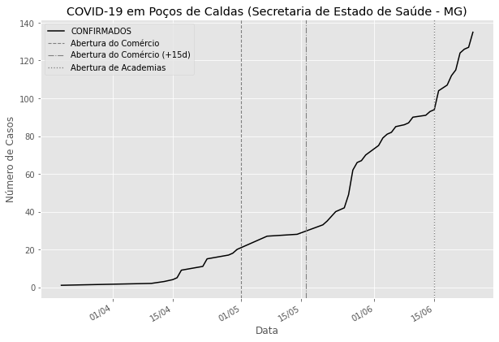
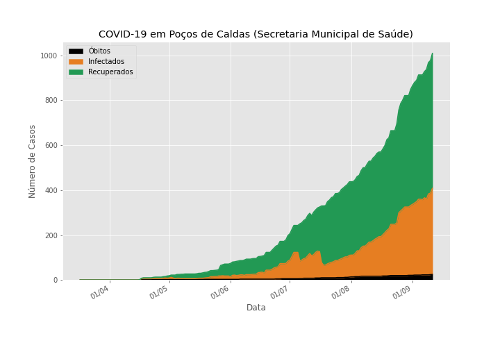
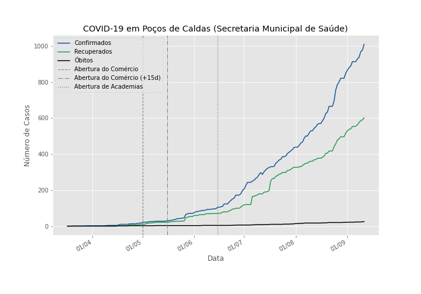

#  COVID-19 cases in Poços de Caldas

A repo for coronavirus related case count data from Poços de Caldas, MG, Brazil.

### Table of Contents
1. [Results](#1-results)
2. [Dataset](#2-dataset)

## 1. Results

This repository download the data from the Health Department of Minas Gerais State and filter just the data from Poços de Caldas. Then, the code counts confirmed cases each day and exports them to the file PC-COVID19-Total-Confirmed-Cases.csv in the paste data. 

### 2. Dataset

Here, we are using data from Healthy Deparment of the State od Minas Gerais, available in:

https://www.saude.mg.gov.br/images/noticias_e_eventos/000_2020/coronavirus-dados-csv/notificacoes-covid19-mg.csv

and the daily epidemiological bulletins published by Poços de Caldas health secretary.

https://pocosdecaldas.mg.gov.br/noticias/64500boletinsdiarios/